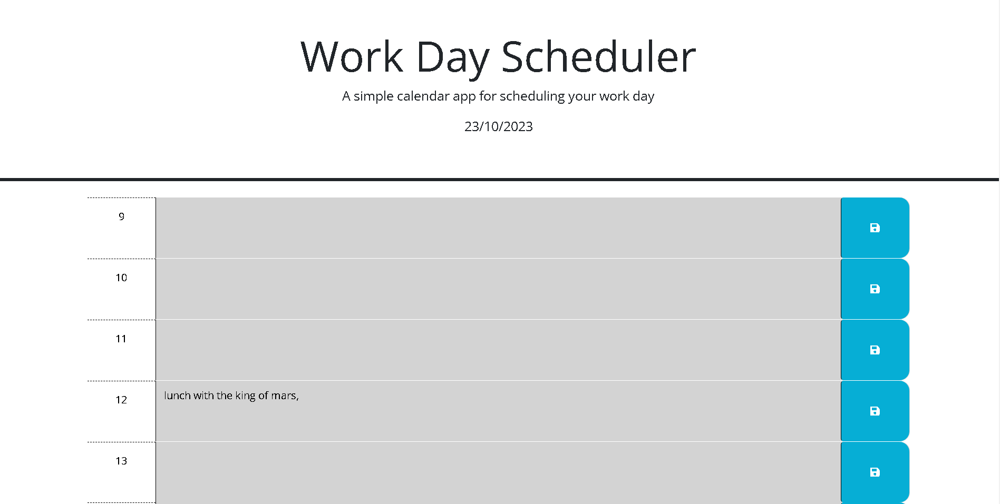
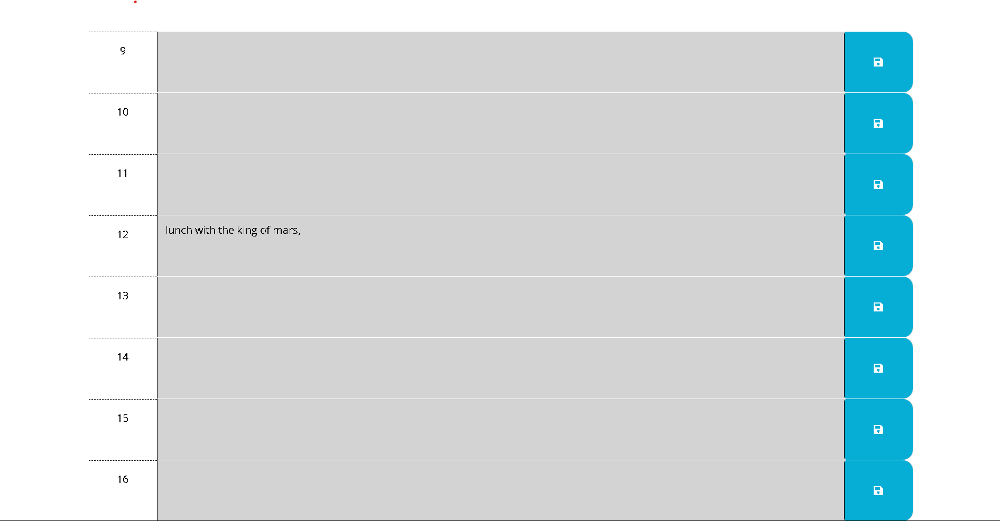

# Day Planner

## Description
    Color coded time blocks representing each hour of a typical business day generated using js (jquery), that save and load into and from localStorage allowing Todos to be tracked upon reload. 

## Screen Shot

## Links
[GitHub]https://github.com/Matt0Stark/event_manager
[GitHubPage]https://matt0stark.github.io/event_manager/

